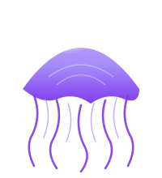

<p align="center">
  
</p>

<h1 align="center">jellyfin-mcp</h1>

<p align="center"><em>Speak to your Jellyfin server in tool calls.</em></p>

[](https://www.typescriptlang.org/)
[](https://nodejs.org/)
[](https://modelcontextprotocol.io/)
[](LICENSE)

An MCP (Model Context Protocol) server for [Jellyfin](https://jellyfin.org). Exposes Jellyfin's management and playback control surface to LLMs — list who's watching what, pause a session, scan a library, run a scheduled task, or message a client, all as typed tool calls.

Companion to [arr-cli](https://github.com/solomonneas/arr-cli) (the *arr stack CLI). arr-cli handles acquiring content; jellyfin-mcp handles serving, monitoring, and controlling playback.

## Features

- **36 MCP tools** covering system info, libraries, users, sessions, items, scheduled tasks, user data writes, playlists, and collections
- Playback control: pause / resume / stop / seek / next / previous / volume / mute / audio-stream / subtitle-stream / cast (remote-play) / send-message
- User data writes: mark watched/unwatched, add/remove favorites
- Playlists: create, list, append, remove entries
- Collections: create, add, remove
- Library scan triggering (per-library or all)
- User admin: list, create, delete, enable/disable, reset password
- Activity log queries for recent events
- Destructive ops (`restart`, `shutdown`, `delete_user`, `set_user_password`) require explicit `confirm: true`
- Works with Claude Desktop, Claude Code, OpenClaw, and any MCP-compatible client

## Tools

### System
- `jellyfin_get_status` — server name, version, OS, pending restart, update availability
- `jellyfin_restart_server` — restart the Jellyfin process *(requires `confirm: true`)*
- `jellyfin_shutdown_server` — stop the Jellyfin process *(requires `confirm: true`)*

### Libraries
- `jellyfin_list_libraries` — all virtual folders with IDs, collection types, paths
- `jellyfin_scan_library` — trigger scan for one library or all

### Users
- `jellyfin_list_users` — with admin / disabled flags and last login timestamps
- `jellyfin_create_user`
- `jellyfin_delete_user` *(requires `confirm: true`)*
- `jellyfin_set_user_disabled`
- `jellyfin_set_user_password` *(requires `confirm: true`)*

### Sessions & Playback
- `jellyfin_list_sessions` — active/idle clients with now-playing, progress, paused state
- `jellyfin_pause_session`
- `jellyfin_resume_session`
- `jellyfin_stop_session`
- `jellyfin_send_message_to_session` — toast/dialog on the client
- `jellyfin_seek_session` — jump to a position in seconds
- `jellyfin_next_track` / `jellyfin_previous_track`
- `jellyfin_set_volume` (0–100) / `jellyfin_set_mute` (mute/unmute/toggle)
- `jellyfin_set_audio_stream` / `jellyfin_set_subtitle_stream` (use -1 to disable subtitles)
- `jellyfin_play_on_session` — cast/remote-play one or more items to a session (PlayNow / PlayNext / PlayLast)

### User Data
- `jellyfin_mark_played` / `jellyfin_mark_unplayed`
- `jellyfin_set_favorite` / `jellyfin_unset_favorite`

### Playlists
- `jellyfin_list_playlists`
- `jellyfin_create_playlist`
- `jellyfin_get_playlist_items` — returns `playlistEntryId` (use this for removal, not the raw item ID)
- `jellyfin_add_to_playlist`
- `jellyfin_remove_from_playlist`

### Collections
- `jellyfin_create_collection`
- `jellyfin_add_to_collection`
- `jellyfin_remove_from_collection`

### Items
- `jellyfin_search_items` — by name, optional type filter
- `jellyfin_get_recent_items` — latest added (per-user)
- `jellyfin_get_item` — full metadata

### Tasks & Activity
- `jellyfin_list_scheduled_tasks`
- `jellyfin_run_scheduled_task`
- `jellyfin_get_activity_log`

## Install

```bash
npm install -g jellyfin-mcp
```

Or from source:

```bash
git clone https://github.com/solomonneas/jellyfin-mcp.git
cd jellyfin-mcp
npm install
npm run build
```

## Configuration

Set these environment variables in your MCP client config:

| Variable | Required | Default | Description |
|----------|----------|---------|-------------|
| `JELLYFIN_URL` | yes | — | Base URL, e.g. `http://localhost:8096` or `https://jellyfin.example.com` |
| `JELLYFIN_API_KEY` | yes | — | API key from Jellyfin Dashboard > API Keys |
| `JELLYFIN_TIMEOUT` | no | `30` | Request timeout in seconds |
| `JELLYFIN_VERIFY_SSL` | no | `true` | Set to `false` for self-signed certs |

### Getting an API key

1. Log into Jellyfin as an admin
2. Dashboard > API Keys > `+`
3. Name it (e.g. `mcp`) and save
4. Copy the value

### Claude Desktop

Add to `~/Library/Application Support/Claude/claude_desktop_config.json` (macOS) or `%APPDATA%\Claude\claude_desktop_config.json` (Windows):

```json
{
  "mcpServers": {
    "jellyfin": {
      "command": "jellyfin-mcp",
      "env": {
        "JELLYFIN_URL": "http://localhost:8096",
        "JELLYFIN_API_KEY": "your-api-key-here"
      }
    }
  }
}
```

### Claude Code

```bash
claude mcp add jellyfin \
  --env JELLYFIN_URL=http://localhost:8096 \
  --env JELLYFIN_API_KEY=your-api-key-here \
  -- jellyfin-mcp
```

Add `--scope user` to make it available from any directory instead of only the current project.

### OpenClaw

If you're running from a source checkout instead of the npm-installed binary, point `command`/`args` at the built `dist/index.js`:

```bash
openclaw mcp set jellyfin '{
  "command": "node",
  "args": ["/absolute/path/to/jellyfin-mcp/dist/index.js"],
  "env": {
    "JELLYFIN_URL": "http://localhost:8096",
    "JELLYFIN_API_KEY": "your-api-key-here"
  }
}'
```

Or, with the global npm install:

```bash
openclaw mcp set jellyfin '{
  "command": "jellyfin-mcp",
  "env": {
    "JELLYFIN_URL": "http://localhost:8096",
    "JELLYFIN_API_KEY": "your-api-key-here"
  }
}'
```

Then restart the OpenClaw gateway so the new server is picked up:

```bash
systemctl --user restart openclaw-gateway
openclaw mcp list   # confirm "jellyfin" is registered
```

### Remote Jellyfin via SSH tunnel

If Jellyfin binds to `localhost` on a remote host (common on Windows media servers), forward the port before starting your MCP client:

```bash
ssh -N -L 8096:localhost:8096 mediaserver
```

Then point `JELLYFIN_URL` at `http://localhost:8096`. The MCP itself has no SSH logic — it just talks HTTP.

## Example Prompts

> What's actively playing on Jellyfin right now?

Calls `jellyfin_list_sessions` with `activeOnly=true`.

> Pause whatever's playing in the living room

Calls `jellyfin_list_sessions`, finds the session by device name, then `jellyfin_pause_session`.

> Scan the Movies library

Calls `jellyfin_list_libraries` to find the ID, then `jellyfin_scan_library`.

> Send a message to my partner's Jellyfin that dinner is ready

`jellyfin_list_sessions` → pick by username → `jellyfin_send_message_to_session`.

> What scheduled tasks have failed recently?

`jellyfin_list_scheduled_tasks` and filter by `lastStatus`.

## Development

```bash
npm install
npm run dev       # watch mode with tsx
npm run typecheck # tsc --noEmit
npm run build     # tsup bundle
npm test          # vitest
```

## License

[MIT](LICENSE)
